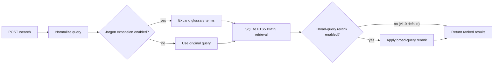

# arxiv-paper-mcp

FastAPI + FastMCP search service over arXiv metadata using SQLite FTS5.

## Recommended run path (Docker)

Pre-built images are published to GHCR for `linux/amd64` and `linux/arm64`.
No build step is needed.

```bash
docker pull ghcr.io/mitchins/arxiv-paper-mcp:latest

docker run -d --name arxiv-paper-mcp \
  -p 8000:8000 \
  --mount type=bind,src=/absolute/path/to/arxiv.db,dst=/data/arxiv.db,readonly \
  -e DB_PATH=/data/arxiv.db \
  ghcr.io/mitchins/arxiv-paper-mcp:latest
```

The image already includes the default `jargon_glossary.json` under `/config`.
Only mount `/config` if you want to supply a custom `.env` or override the
glossary.

Stop:

```bash
docker rm -f arxiv-paper-mcp
```

Validate after first start:

```bash
python3 scripts/smoke_runtime.py --endpoint http://127.0.0.1:8000 --iterations 7 --query "transformer" --search-timeout 180 --startup-wait 60 --warmup
```

Compose is still supported if preferred:

```bash
ARXIV_DB_HOST_PATH=/absolute/path/to/arxiv.db docker compose up -d --wait
```

The stock compose file already mounts `./config` to `/config`. You can leave
that directory empty, or point `ARXIV_CONFIG_HOST_PATH` somewhere else when you
want to override `.env` or `jargon_glossary.json`.

### Search flow



To build from source (development), see [docs/development.md](docs/development.md)
or run `bash scripts/dev_up.sh` which builds locally and runs smoke tests.

## API quick check

```bash
curl -fsS http://127.0.0.1:8000/health
```

```bash
curl -fsS -X POST http://127.0.0.1:8000/search \
  -H 'Content-Type: application/json' \
  -d '{"query":"transformer","limit":10}'
```

## Search defaults for v1.0

- Jargon expansion enabled
- Broad-query reranking disabled

These are the frozen production defaults and should not be changed without re-evaluation.

## Where detailed docs live

- Development and benchmarking: docs/development.md
- Operations and rollout checklist: docs/ops_1_0_checklist.md
- Search freeze/baseline evidence: docs/production_freeze_20260329.md
- GitHub release and branch protection setup: docs/github_release_setup.md
- Release note template: docs/release_notes_template.md
